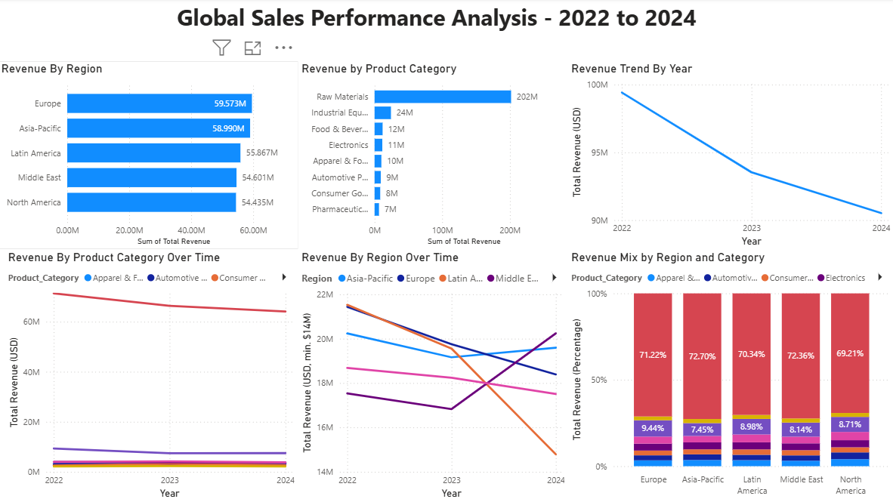
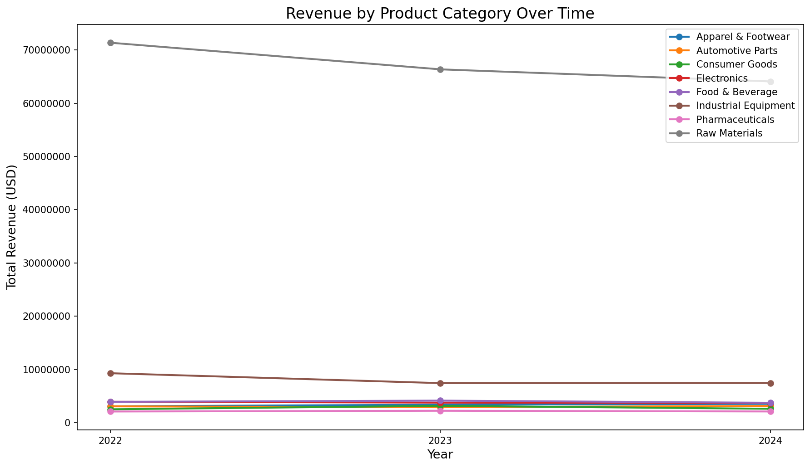
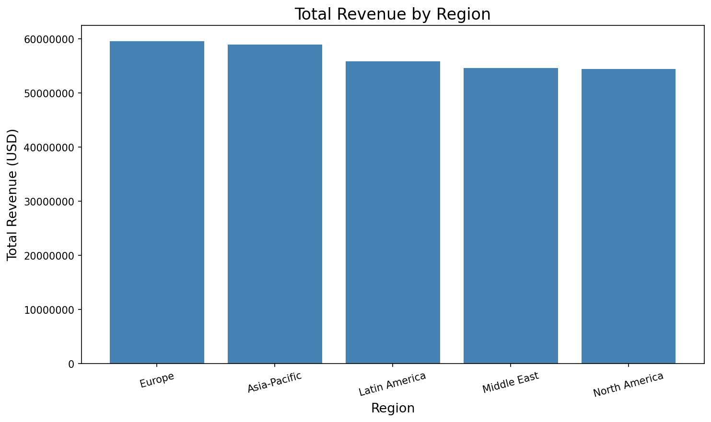
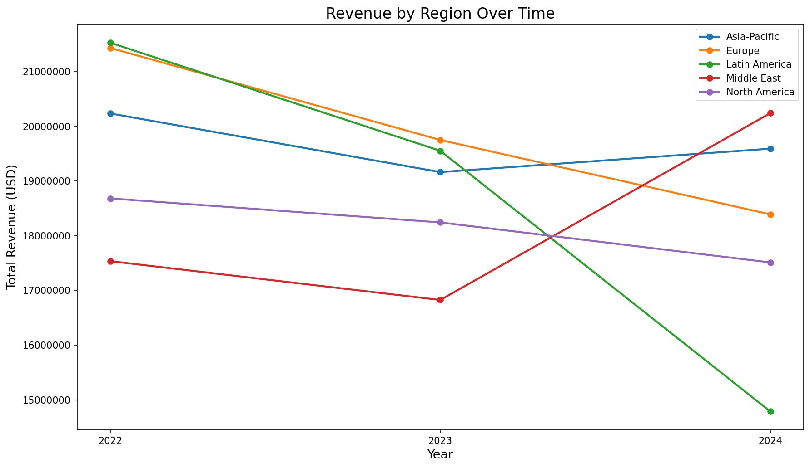
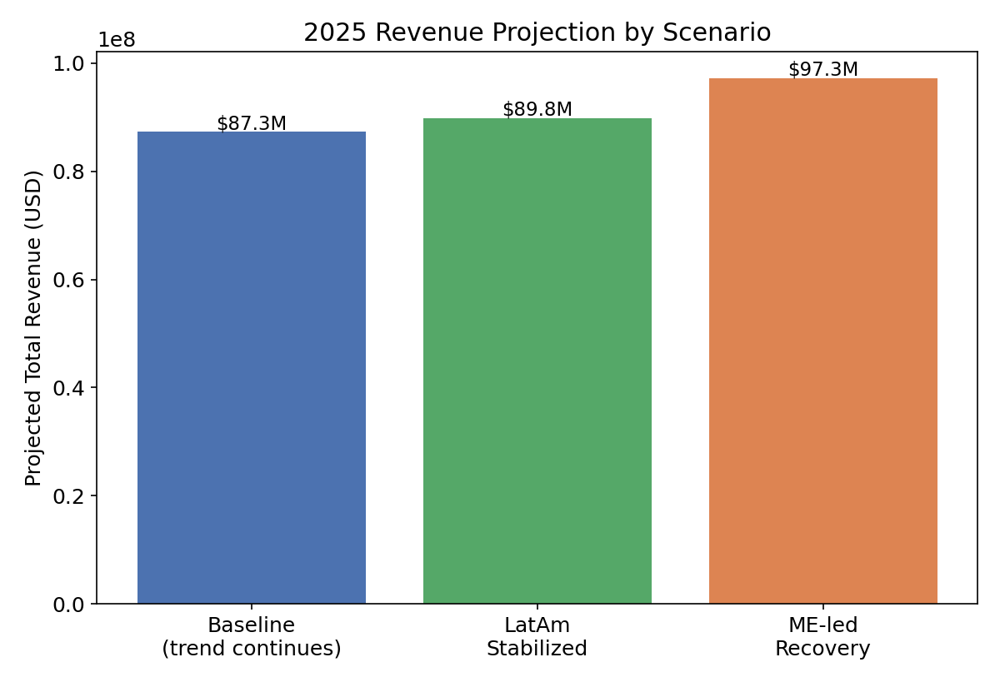
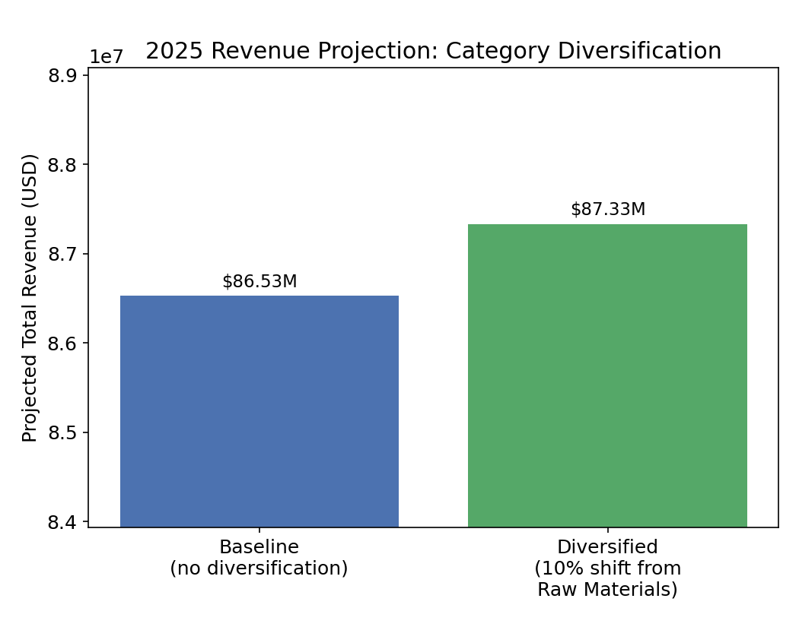

# Global Sales Performance Analysis - Multinational Conglomerate (2022 - 2024)

## Executive Summary

This project presents an end-to-end analysis of global sales 
performance for a fictional multinational conglomerate operating 
across five regions and eight product categories from 2022 to 
2024, covering the full analyst workflow, synthetic data 
generation, cleaning, exploratory analysis, SQL querying, and 
dashboard delivery using Python, SQL, and Power BI.

Total revenue declined 8.95% over the three-year window, from 
$99.4M to $90.5M, driven by sustained softness in Raw Materials 
and Industrial Equipment, the former compounded by a structural 
concentration risk: Raw Materials alone accounts for 70% of 
total revenue. A forward-looking revenue simulation built on each 
region and category's actual CAGR quantifies both the cost of 
inaction and the upside of intervention: stabilizing Latin 
America's decline alone would protect $2.5M in 2025 revenue, and 
matching the Middle East's growth rate across all regions would 
generate a $10.0M upside relative to the current trend.

---

## Business Problem

A multinational company experienced a consistent year-over-year 
revenue decline between 2022 and 2024, representing a cumulative 
loss of approximately $8.9M in annual revenue. Stakeholders 
required a clear understanding of where the decline was 
concentrated, by region, by product category, and over time, in 
order to identify actionable opportunities to reverse the trend. 
This analysis was built to answer four core questions:

1. Which regions generate the most and least revenue?
2. What product categories are the top sellers by region?
3. Are there seasonal trends in sales across markets?
4. What does the year-over-year revenue trend look like, and 
where is the decline concentrated?

---

## Dashboard



---

## Methodology

1. **Scope Definition:** Defined the business problem, selected 
the scenario, and established dataset parameters including five 
regions, eight product categories, row count, and intentional data 
quality issues to simulate.

2. **Data Generation:** Synthetically generated three years of 
monthly sales transactions (2022-2024) across five global regions 
(North America, Europe, Asia-Pacific, Latin America, Middle East) 
and eight product categories, with realistic pricing logic, 
geographic accuracy, and currency matching. The raw dataset 
contains 7,201 rows and 11 columns, with 12% of entries containing 
intentional data quality issues, duplicates, missing values, 
formatting inconsistencies, incorrect data types, and outliers 
to simulate realistic cleaning conditions.

3. **Data Cleaning (Python):** Removed duplicates, handled 
missing values, standardized formatting, corrected data types, and 
removed outliers using category-level price caps. Final cleaned 
dataset: 6,672 rows, 12 columns.

4. **Exploratory Data Analysis (Python):** Produced seven charts 
examining revenue by region, category, year, country, and time to 
surface key trends and patterns.

5. **SQL Analysis (SQLite):** Wrote five queries covering 
regional revenue share, category performance by region, 
year-over-year trends using LAG window functions, cumulative 
change calculation, and seasonal patterns, surfacing a December 
transaction-value anomaly.

6. **Revenue Impact Simulation (Python):** Built a forward-looking 
simulation modeling 2025 revenue scenarios using each region and 
category's actual 2022-2024 CAGR, quantifying the impact of 
regional stabilization, best-region-matched growth, and category 
diversification.

7. **Dashboard (Power BI):** Built a six-visual interactive 
dashboard presenting core findings for a business audience.

8. **Insight Narrative:** Wrote a structured business document 
translating analytical findings into plain language recommendations 
for stakeholders.

9. **Documentation:** Organized project files into a structured 
repository and created this README.

---

## Skills

**Python (pandas, matplotlib, seaborn):** Data loading, cleaning, 
and exploratory analysis; category-level outlier capping; 
CAGR-based revenue scenario simulation

**SQL (SQLite):** 5 analytical queries covering regional revenue 
share, category performance, YoY trends via LAG, cumulative 
change, and seasonal pattern detection

**Power BI:** 6-visual interactive dashboard for stakeholder-facing 
exploration of revenue trends by region, category, and time period

---

## Results

**Raw Materials concentration creates significant revenue 
exposure.** Raw Materials accounts for 70% of total company 
revenue across all regions, generating nearly ten times more than 
the second-highest category, Industrial Equipment.



**Total revenue declined 8.95% over the three-year window.** 
Revenue fell from $99.4M to $90.5M annually between 2022 and 2024, 
driven primarily by consistent Raw Materials and Industrial 
Equipment sales declines across all regions.



**Regional performance diverged sharply.** The Middle East is the 
only region showing growth momentum, recovering above its 2022 
revenue baseline by 2024. Asia-Pacific showed partial recovery 
after a dip in 2023. North America, Europe, and Latin America all 
declined, with Latin America's 2023–2024 decline the sharpest and 
broadest across all countries in the region, suggesting a 
regional demand shift rather than a country-specific issue.



**Category performance reveals both risk and opportunity.** 
Pharmaceuticals is the lowest-performing category by total revenue 
and, alongside Consumer Goods and Automotive Parts, represents a 
growth opportunity less directly tied to global commodity dynamics 
than Raw Materials or Industrial Equipment.

**A seasonal pricing anomaly emerged during SQL analysis.** 
December consistently generates the highest revenue per 
transaction of any month, nearly double the next-highest month, 
July, despite having the lowest transaction count, warranting 
further investigation.

---

## Business Recommendation

The following recommendations are grounded in both the descriptive 
findings above and a forward-looking revenue simulation built on 
each region and category's actual 2022–2024 compound annual growth 
rate (CAGR). All projected figures are derived directly from the 
cleaned dataset and no figures are assumed.

**Stabilize Latin America's decline.** Latin America posted the 
steepest regional decline in the dataset. If current trends 
continue unchanged, total company revenue is projected to fall 
further to $87.3M in 2025; halting Latin America's decline at its 
2024 level alone would protect approximately $2.5M in revenue 
relative to that baseline. Determining whether the downturn is 
economic, competitive, or product-fit related is the necessary 
first step before designing a recovery plan.



**Prioritize the Middle East as a growth model.** The Middle East 
was the only region to recover above its 2022 baseline by 2024, 
posting a 7.44% CAGR - the strongest in the dataset. If every 
region matched that growth rate, total 2025 revenue would reach 
$97.3M, a $10.0M upside relative to the baseline trend. The Middle 
East's approach is worth investigating as a template for other 
underperforming regions.

**Reduce category concentration risk.** Raw Materials' 70% revenue 
share leaves the business exposed to commodity demand volatility. 
Shifting just 10% of total revenue mix away from Raw Materials 
into the three categories with positive 2022–2024 growth (Apparel 
& Footwear, Automotive Parts, Consumer Goods) would generate a 
projected $804K revenue uplift in 2025, even without assuming any 
change in each category's underlying growth rate.



Together, these three interventions quantify both the revenue at 
risk from inaction and the upside available from targeted action 
across two of the report's primary levers: regional performance 
and category mix.

---

## Next Steps

**Real world data validation.** This dataset was synthetically 
generated and is not representative of any real company's 
transactions. It reflects a revenue concentration in Raw Materials 
and a regional revenue distribution more even than would typically 
be observed in a real multinational business context, both likely 
more exaggerated than reality. Applying this analytical framework 
to real transactional data, including returns, discounts, and 
multi-currency reconciliation not modeled here, would be the 
necessary next step to validate these findings in a production 
context.

**Seasonal anomaly investigation.** The December transaction-value 
anomaly identified during SQL analysis warrants a dedicated 
investigation into whether it reflects pricing strategy, large 
enterprise contract timing, or another structural cause.

**Latin America root-cause analysis.** Determining whether Latin 
America's decline is economic, competitive, or product-fit 
related, and whether it is occurring uniformly across countries 
or concentrated in specific markets, would require country-level 
data beyond the aggregate regional view used in this analysis.

**Category-level diversification modeling.** The diversification 
scenario models a uniform 10% shift away from Raw Materials. A 
more granular model incorporating customer-level or contract-level 
data would refine which specific accounts or product lines are 
best positioned to absorb that shift.

---

## Repository Structure

```bash
Global-Sales-Performance-Analysis/
│
├── README.md                                        — This document
│
├── charts
│   ├── chart01_revenue_by_region.png
│   ├── chart02_revenue_by_category.png
│   ├── chart03_revenue_by_year.png
│   ├── chart04_top10_countries.png
│   ├── chart05_revenue_heatmap.png
│   ├── chart06_category_over_time.png
│   ├── chart07_region_over_time.png
│   ├── chart08_revenue_impact_scenarios.png
│   └── chart09_category_diversification.png
│
├── data/
│   ├── raw/
│   │    └─ global_sales_performance.csv                 — Raw dataset (7,201 rows, 11 columns)
│   ├── cleaned/
│   │    └─ Global_Sales_Performance_Cleaned.csv         — Cleaned dataset (6,672 rows, 12 columns)
│   └── charts/
│        └─ [7 PNG files]                                — Python EDA visualizations
│
├── python/
│   ├── Global_Sales_Performance_Cleaning.ipynb      — Data cleaning notebook (pandas)
│   └── Global_Sales_Performance_EDA.ipynb           — Exploratory data analysis notebook
│
├── sql/
│   ├── 01_revenue_by_region.sql                     — Regional revenue with share percentage
│   ├── 02_revenue_by_category_per_region.sql        — Category performance by region
│   ├── 03_year_over_year_trend.sql                  — YoY revenue change using LAG
│   ├── 04_cumulative_change.sql                     — Cumulative 3-year revenue change
│   └── 05_seasonal_trends.sql                       — Monthly revenue and transaction patterns
│
├── dashboard/
│   ├── Global_Sales_Performance_Dashboard.pbix      — Interactive Power BI dashboard
│   └── dashboard_screenshot.png                     — Dashboard screenshot
│
└── insights/
    └── Global_Sales_Performance_Insight_Narrative   — Full business narrative and recommendations
```

---

## How to Run

This project requires Python with pandas, matplotlib, and seaborn installed via Anaconda, a SQLite-compatible SQL client such as DBeaver for the SQL queries, and Power BI Desktop for the dashboard file. All data files are located in the data folder.
